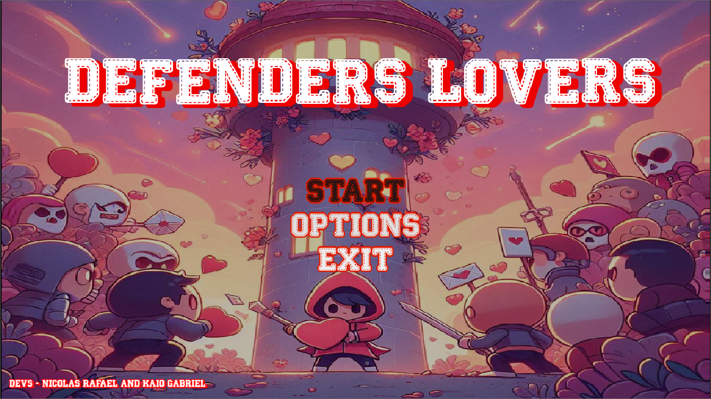

# ***Game: Defenders Lovers***
O jogo Defenders Lovers foi desenvolvido em grupo durante uma game jam de uma semana, com o tema "mensagem e amor". O jogo consiste em um coração que defende uma torre de cartas contra vários inimigos.

> # 🚀 CONCEITO
> * O objetivo do jogo Defenders Lovers é que o jogador defenda a torre pelo maior tempo possível. Trata-se de um jogo 2D, estilo top-down, do gênero tower defense.

> # 🔦 TECNOLOGIAS UTILIZADAS
> * **Godot engine:** O motor utilizado no desenvolvimento do jogo.
> * **GDScript:** A linguagem de programação utilizada na engine.
> * **Git/GitHub:** Utilizados para armezanar o código.
> * **Notion:** Utilizado para a documentação do projeto.

> # 💻 [VEJA O PROJETO](https://nicolasraf.itch.io/defenders-lovers)
> 

> # 🔗 CLONE DO PROJETO
> ``` bash
> git clone https://github.com/NicolasRaf/Defenders-Lovers.git

> # 📱 CONTATO
> * **Kaio Gabriel**
>> [](kkaiogabrielk@gmail.com)
>> [](https://www.linkedin.com/in/kaio-gabriel-de-sousa-carvalho-baa05b313/?utm_source=share&utm_campaign=share_via&utm_content=profile&utm_medium=android_app)
>> [](https://github.com/KaioGabriel-the)
> * **Nicolas Rafael**
>> [](nicolasalves136@gmail.com)
>> [](https://www.linkedin.com/in/nicolas-rafael-2992172b8/?utm_source=share&utm_campaign=share_via&utm_content=profile&utm_medium=android_app)
>> [](https://github.com/NicolasRaf)
